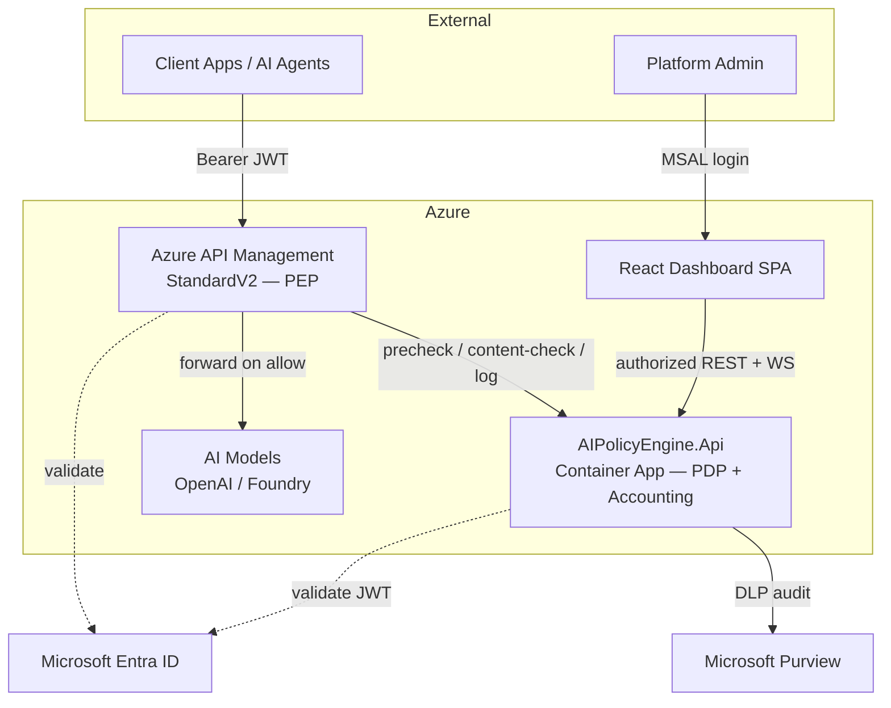
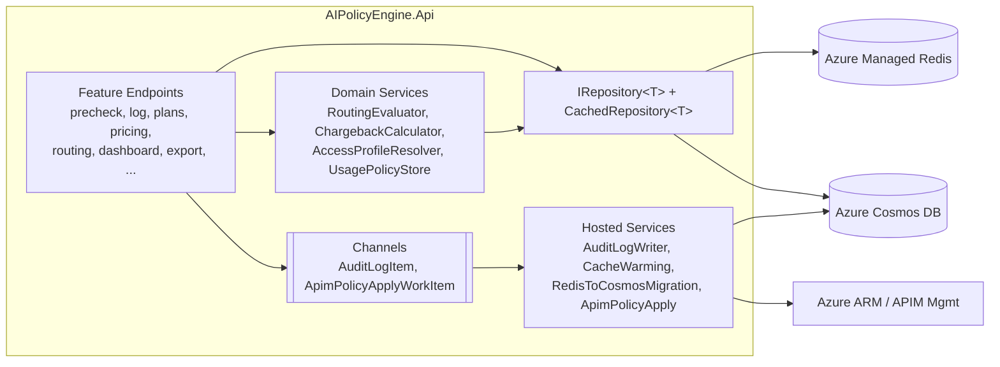
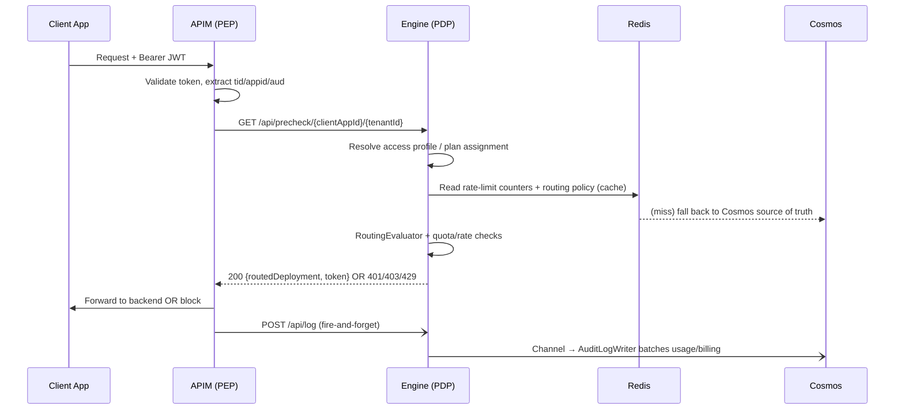

# Project Architecture Blueprint — Azure AI Gateway Policy Engine

> Generated: 2026-07-22
> Scope: Full-stack architectural reference for maintaining consistency and guiding new development.
> Detected stack: **.NET 10 (ASP.NET Minimal APIs) + .NET Aspire + React/TypeScript + Azure (Terraform IaC)**
> Detected pattern: **Layered + Repository (write-through cache) over a Serverless/Container-hosted, Event-driven-augmented monolith**

---

## 1. Architecture Detection and Analysis

### Technology stacks in use

| Concern | Technology | Evidence |
|---------|-----------|----------|
| Backend runtime | .NET 10, ASP.NET Core Minimal APIs | [src/AIPolicyEngine.Api/AIPolicyEngine.Api.csproj](../src/AIPolicyEngine.Api/AIPolicyEngine.Api.csproj), [Program.cs](../src/AIPolicyEngine.Api/Program.cs) |
| Orchestration (local dev) | .NET Aspire (`DistributedApplication`) | [src/AIPolicyEngine.AppHost/AppHost.cs](../src/AIPolicyEngine.AppHost/AppHost.cs) |
| Cross-cutting defaults | Aspire ServiceDefaults (OpenTelemetry, health, resilience, service discovery) | [src/AIPolicyEngine.ServiceDefaults/Extensions.cs](../src/AIPolicyEngine.ServiceDefaults/Extensions.cs) |
| Durable store | Azure Cosmos DB (single `configuration` container + audit/billing) | `Cosmos*Repository.cs`, [CosmosRepositoryBase.cs](../src/AIPolicyEngine.Api/Services/CosmosRepositoryBase.cs) |
| Hot cache | Azure Managed Redis / StackExchange.Redis | [CachedRepository.cs](../src/AIPolicyEngine.Api/Services/CachedRepository.cs) |
| API gateway | Azure API Management (StandardV2) | [policies/](../policies), README request flow |
| Identity | Microsoft Entra ID (JWT Bearer via Microsoft.Identity.Web) | [Program.cs](../src/AIPolicyEngine.Api/Program.cs) auth block |
| Compliance / DLP | Microsoft Purview (Graph client) | [PurviewServiceExtensions.cs](../src/AIPolicyEngine.Api/Services/PurviewServiceExtensions.cs) |
| Frontend | React + TypeScript + Vite + MSAL | [src/aipolicyengine-ui/](../src/aipolicyengine-ui) |
| Real-time | Native WebSockets | [WebSocketEndpoints.cs](../src/AIPolicyEngine.Api/Endpoints/WebSocketEndpoints.cs) |
| Infra as Code | Terraform (modularized) | [infra/terraform/](../infra/terraform) |
| Observability | OpenTelemetry → Azure Monitor | ServiceDefaults + README |

### Architectural pattern determination

The system is a **single-deployable modular monolith** (`AIPolicyEngine.Api`) rather than microservices. Within it, the code follows a **layered architecture** with a strict **Repository pattern** and a distinctive **write-through cache decorator** (`CachedRepository<T>`). Event-driven elements appear internally via **in-process channels + background hosted services** (audit logging, APIM policy application, migration, cache warming). The deployment topology is **cloud-native / container-hosted** (Azure Container Apps) fronted by APIM acting as the enforcement point.

---

## 2. Architectural Overview

The Azure AI Gateway Policy Engine implements **AAA (Authentication, Authorization, Accounting) for AI workloads**, inspired by telecom/RADIUS principles. APIM is the *policy enforcement point (PEP)*; `AIPolicyEngine.Api` is the *policy decision point (PDP)* and the *accounting/billing engine*.

**Guiding principles evident in the code:**

- **Source-of-truth + cache separation.** Cosmos DB is authoritative; Redis is a rebuildable write-through cache. Writes always hit Cosmos first, then Redis ([CachedRepository.cs](../src/AIPolicyEngine.Api/Services/CachedRepository.cs)).
- **Hot-path minimization.** The `/api/precheck` decision path adds a further **in-memory 30-second TTL cache** for routing policies to avoid even Redis on every request ([PrecheckEndpoints.cs](../src/AIPolicyEngine.Api/Endpoints/PrecheckEndpoints.cs)).
- **Pure, testable decision logic.** Routing (`RoutingEvaluator`) and billing (`ChargebackCalculator`) are isolated from I/O so they are deterministically unit-testable.
- **Fire-and-forget accounting.** Usage logging is decoupled from request handling through unbounded channels and background writers, so billing never blocks the gateway.
- **Convention over ceremony.** Minimal APIs grouped by feature via `Map*Endpoints()` extension methods, singleton services, explicit DI wiring in `Program.cs`.

**Architectural boundaries and enforcement:**

- **Gateway boundary** — APIM ↔ Engine over HTTP; enforced by Entra JWT + role-scoped authorization policies (`ApimPolicy`, `ExportPolicy`, `AdminPolicy`).
- **Persistence boundary** — all data access flows through `IRepository<T>`; no endpoint touches Cosmos or Redis SDK types directly (except the hot-path precheck which reads Redis for rate-limit counters).
- **Frontend boundary** — SPA is served from the same container but authenticates independently via MSAL and consumes the same authorized REST API.

---

## 3. Architecture Visualization

### C4 — System Context



### C4 — Container / Component



### Data / decision flow — request precheck



---

## 4. Core Architectural Components

### 4.1 Feature Endpoints (`Endpoints/*.cs`)
- **Purpose:** HTTP surface; one static class per feature exposing `Map<Feature>Endpoints(this IEndpointRouteBuilder)`.
- **Structure:** Minimal API handlers with DI-injected services; grouped registration in [Program.cs](../src/AIPolicyEngine.Api/Program.cs).
- **Interaction:** Consume `IRepository<T>`, domain services, and channels. Authorization applied per-route via `.RequireAuthorization("<policy>")`.
- **Evolution:** Add a feature = add `XEndpoints.cs` with a `MapXEndpoints()` extension, then one `app.MapXEndpoints()` line.

### 4.2 Domain Services (`Services/*.cs`)
- **Pure logic:** `RoutingEvaluator` (static, no deps), `ChargebackCalculator`/`ChargebackMetrics`, `BillingPeriodCalculator`, `RoutingPolicyValidator`.
- **Stateful/cached:** `UsagePolicyStore`, `AccessProfileResolver`, `DeploymentDiscoveryService`, `LogDataService`.
- **Lifetime:** Registered as singletons — internal caches with TTL guard against staleness.

### 4.3 Repository Layer (`IRepository<T>`, `CosmosRepositoryBase<T>`, `CachedRepository<T>`)
- **Purpose:** Uniform CRUD abstraction over Cosmos with a transparent Redis cache decorator.
- **Pattern:** Decorator — `CachedRepository<T>` wraps a `Cosmos*Repository`. Read = Redis→Cosmos fallback; Write = Cosmos→Redis. See [CachedRepository.cs](../src/AIPolicyEngine.Api/Services/CachedRepository.cs).
- **Partitioning:** All configuration entities share one Cosmos container partitioned by a logical `partitionKey` (e.g., `plan`, `client`) via [CosmosRepositoryBase.cs](../src/AIPolicyEngine.Api/Services/CosmosRepositoryBase.cs).

### 4.4 Background / Hosted Services
- `RedisToCosmosMigrationService` — one-time migration on startup (runs first, blocking).
- `CacheWarmingService` — preloads Redis after migration.
- `AuditLogWriter` — drains `Channel<AuditLogItem>`, batches Cosmos writes.
- `ApimPolicyApplyBackgroundService` — drains `Channel<ApimPolicyApplyWorkItem>`, applies APIM policies via ARM.
- **Ordering matters:** registration order in `Program.cs` is intentional (migration → warming → apply).

### 4.5 Frontend SPA (`aipolicyengine-ui`)
- 10 feature pages (Dashboard, Quotas/Clients, Plans, Pricing, Routing, Access, Apis, RequestBilling, Export, ClientDetail).
- MSAL-based auth; path-based tab routing implemented manually in [App.tsx](../src/aipolicyengine-ui/src/App.tsx); WebSocket live dashboard.

---

## 5. Architectural Layers and Dependencies

```
Endpoints (HTTP)  →  Domain Services  →  Repositories (IRepository<T>)  →  Cosmos / Redis
      │                    │                        ▲
      └──── Channels ──────┴──── Hosted Services ───┘  (async accounting / provisioning)
```

- **Dependency rule:** dependencies point inward/downward. Endpoints never bypass repositories for configuration data.
- **Abstraction mechanism:** interfaces (`IRepository<T>`, `IChargebackCalculator`, `IUsagePolicyStore`, `IAccessProfileResolver`, `IPurviewAuditService`) enable substitution + testing.
- **No circular dependencies** observed; pure-logic services (`RoutingEvaluator`) have zero infrastructure dependencies.
- **DI:** constructor injection throughout; explicit factory lambdas in `Program.cs` compose `CachedRepository<T>` around each `Cosmos*Repository`.

---

## 6. Data Architecture

- **Domain models** live in `Models/*.cs` as sealed POCOs (`PlanData`, `ClientPlanAssignment`, `ModelPricing`, `ModelRoutingPolicy`, `AccessProfile`, `UsagePolicySettings`, `QuotaData`, `UsageData`, audit/billing documents).
- **Entity shape** carries persistence hints inline (e.g., `PartitionKey = "plan"`, `Id`) — see [PlanData.cs](../src/AIPolicyEngine.Api/Models/PlanData.cs).
- **Customer key composition:** billing/quota keyed on `clientAppId:tenantId` to support multi-tenant SaaS consumers.
- **Access patterns:** repository per entity type + generic `IRepository<T>`; `GetAll` always hits Cosmos (authoritative listing), point reads prefer Redis.
- **Caching strategy:** write-through (Redis), plus short-lived in-memory TTL caches on hot paths (routing policy 30s; pricing 30s in `ChargebackCalculator`).
- **Validation:** dedicated validators (`RoutingPolicyValidator`) and request DTOs (`*Request.cs`) separate wire contracts from stored entities.

---

## 7. Cross-Cutting Concerns

**Authentication & Authorization**
- Entra ID JWT Bearer (`AddMicrosoftIdentityWebApi`); role-based policies `AIPolicy.Export`, `AIPolicy.Apim`, `AIPolicy.Admin`; fallback policy requires authenticated user. Static SPA assets + SPA fallback are explicitly `AllowAnonymous`.

**Error Handling & Resilience**
- Cosmos `NotFound` handled as `null` in repositories; Redis failures caught (`RedisException`) and logged, then fall back to Cosmos — cache is never a hard dependency. Aspire ServiceDefaults add standard resilience handlers to outbound HTTP.

**Logging & Monitoring**
- OpenTelemetry (traces/metrics/logs) via ServiceDefaults exported to Azure Monitor; custom metrics via `ChargebackMetrics`; structured `ILogger` throughout.

**Validation**
- Boundary DTO validation + domain validators; enums serialized as strings, camelCase JSON configured globally in `Program.cs`.

**Configuration Management**
- `appsettings*.json` + `IOptions<ApimManagementOptions>`; secrets via Managed Identity (`DefaultAzureCredential`) in Azure, password fallback for local Aspire containers; user-secrets for the demo client.

---

## 8. Service Communication Patterns

- **APIM ↔ Engine:** synchronous HTTP for `/api/precheck` and `/api/content-check` (blocking decisions); asynchronous fire-and-forget for `/api/log` (accounting).
- **Engine ↔ SPA:** REST (authorized) + WebSocket push (`/ws/logs`, 5-second server loop) for live metrics.
- **Engine ↔ Azure control plane:** ARM SDK (`ArmClient`) for APIM policy application and deployment discovery, driven off channels/background services.
- **Internal:** `System.Threading.Channels` decouple producers (endpoints) from consumers (hosted writers).

---

## 9. Technology-Specific Patterns (.NET)

- **Host model:** `WebApplication.CreateBuilder` + `AddServiceDefaults()`; `Program` is `public partial` to expose to tests/benchmarks.
- **Middleware order (intentional):** health endpoints → OpenAPI (dev) → CORS → **static files before auth** → auth/authorization → WebSockets → feature endpoints → SPA fallback.
- **Minimal APIs** with feature-grouped extension methods.
- **DI container** composes decorators via explicit factory lambdas.
- **Aspire integrations:** `AddRedisClient`, `AddAzureCosmosClient` with token-credential configuration.

---

## 10. Implementation Patterns

- **Repository:** implement `CosmosRepositoryBase<T>` (provide partition key + `PrepareForCosmos`), then wrap with `CachedRepository<T>` in `Program.cs` supplying a Redis key function and an entity-id selector.
- **Decision services:** keep pure and static where possible (`RoutingEvaluator.Evaluate` returns a `RoutingResult`); no I/O.
- **Endpoint:** static class + `Map<Feature>Endpoints`; inject repositories/services; apply authorization policy per route.
- **Async accounting:** publish to a `Channel<T>`, consume in an `IHostedService` that batches writes.

---

## 11. Testing Architecture

- **Frameworks:** xUnit (`AIPolicyEngine.Tests`), integration tests (`Integration/`), `ChargebackApiFactory` (WebApplicationFactory), `FakeRedis` test double, BenchmarkDotNet (`AIPolicyEngine.Benchmarks`), load tests (`AIPolicyEngine.LoadTest`).
- **Boundaries:** pure-logic unit tests (routing, pricing, billing periods), repository tests, endpoint/integration tests. 198+ tests per README.
- **Test doubles:** `ChargebackCalculator` ships test-only constructors accepting a pre-seeded pricing cache / null Redis — pure logic testable without infrastructure.

---

## 12. Deployment Architecture

- **Topology:** APIM (StandardV2) → Azure Container App (`AIPolicyEngine.Api`) → Cosmos DB + Azure Managed Redis; Azure Monitor + Purview integrations.
- **IaC:** Terraform, modularized under [infra/terraform/modules/](../infra/terraform/modules) — `identity`, `gateway`, `ai_services`, `compute`, `data`, `monitoring`.
- **Two-stage deploy** (README): (1) `terraform apply` provisions infra incl. ACR with placeholder image; (2) `deploy-container.ps1` builds/pushes image to the provisioned ACR and updates the Container App — required because enterprise environments block public registries.
- **Local dev:** `dotnet run --project AIPolicyEngine.AppHost` starts Aspire with Redis + Cosmos emulator containers; dashboard at `https://localhost:17224`.
- **Multi-tenant:** `register-secondary-tenant.ps1` provisions service principals in secondary Entra tenants.

---

## 13. Extension and Evolution Patterns

**Add a feature/endpoint**
1. Create `Models/*.cs` DTOs + entity (with `PartitionKey`).
2. Add `Cosmos<Entity>Repository : CosmosRepositoryBase<T>`.
3. Register `CachedRepository<T>` wrapper in `Program.cs`.
4. Create `Services/` logic (pure where possible).
5. Add `Endpoints/<Feature>Endpoints.cs` + `Map<Feature>Endpoints()`; wire one line in `Program.cs`; apply an authorization policy.
6. Add SPA page under `aipolicyengine-ui/src/pages` + tab in `App.tsx` if user-facing.

**Add async processing:** define a record work-item, register a `Channel<T>`, add an `IHostedService` consumer, respecting startup ordering.

**Integrate an external system:** wrap in a service interface (see `IPurviewAuditService` / `NoOpPurviewAuditService`) so it can be disabled/faked.

---

## 14. Architectural Pattern Examples

- **Decorator / cache separation:** `CachedRepository<T>` write path (Cosmos first, then Redis) — [CachedRepository.cs](../src/AIPolicyEngine.Api/Services/CachedRepository.cs).
- **Pure decision logic:** `RoutingEvaluator.Evaluate` priority-ordered rule matching with default behavior — [RoutingEvaluator.cs](../src/AIPolicyEngine.Api/Services/RoutingEvaluator.cs).
- **Feature-grouped endpoints:** `MapPrecheckEndpoints` with per-route `RequireAuthorization` — [PrecheckEndpoints.cs](../src/AIPolicyEngine.Api/Endpoints/PrecheckEndpoints.cs).
- **Null-object integration:** `IPurviewAuditService` / `NoOpPurviewAuditService` for optional compliance.

---

## 15. Architectural Decision Records (inferred)

| Decision | Context | Consequence |
|----------|---------|-------------|
| Cosmos as source of truth, Redis as write-through cache | Redis-only lost config on flush/upgrade | Durable config; cache always rebuildable; two writes per mutation |
| Single modular monolith (not microservices) | One decision engine, low operational overhead | Simple deploy/scaling; must keep internal module boundaries disciplined |
| APIM = PEP, Engine = PDP | Enforce AAA at the gate before backend | Requests blocked early (401/403/429); engine stays stateless per request |
| Channels + hosted services for accounting | Billing must not block the hot path | Fire-and-forget logging; eventual consistency for usage/billing |
| In-memory TTL caches on hot path | Avoid Redis round-trips per precheck | Sub-ms decisions; up to 30s staleness on routing/pricing |
| Minimal APIs + singletons | Throughput + simplicity over MVC ceremony | Terse wiring; discipline needed in `Program.cs` composition root |

---

## 16. Architecture Governance

- **Consistency enforced by:** the `IRepository<T>` + `CachedRepository<T>` convention, feature-grouped `Map*Endpoints` pattern, centralized JSON/auth/DI config in `Program.cs`, and the pure-logic services split.
- **Automated checks:** unit + integration test suite, benchmarks, and load tests guard performance-sensitive paths (routing/serialization/endpoints).
- **Docs:** [docs/ARCHITECTURE.md](ARCHITECTURE.md), [DOTNET_DEPLOYMENT_GUIDE.md](DOTNET_DEPLOYMENT_GUIDE.md), [USAGE_EXAMPLES.md](USAGE_EXAMPLES.md), [FAQ.md](FAQ.md).

---

## 17. Blueprint for New Development

**Workflow by feature type**
- *Config-backed feature:* Model → Cosmos repo → CachedRepository registration → Service → Endpoint → SPA page.
- *Decision logic:* add a pure static/injected service with unit tests before wiring into precheck.
- *Accounting/provisioning:* channel + hosted service; respect startup ordering.

**Templates**
- Repository: extend `CosmosRepositoryBase<T>`.
- Endpoint: static class + `Map<Feature>Endpoints` extension + `RequireAuthorization`.
- Service interface + optional `NoOp*` implementation for optional integrations.

**Common pitfalls to avoid**
- Bypassing `IRepository<T>` and hitting Cosmos/Redis directly from endpoints (breaks caching contract).
- Doing blocking I/O on the `/api/precheck` hot path — prefer TTL in-memory caches.
- Blocking request handling on accounting writes — always use channels.
- Registering hosted services out of order (migration must precede cache warming).
- Placing auth middleware before static files (would block anonymous SPA/login assets).
- Forgetting per-route authorization policy — the fallback policy still requires an authenticated user, but sensitive routes need explicit roles.

---

### Maintenance
Regenerate this blueprint when: new top-level projects are added, the persistence/caching strategy changes, the deployment topology changes (e.g., splitting the monolith), or authorization policies are revised. Keep diagrams in sync with `Program.cs` wiring and the `Endpoints/`, `Services/`, and `Models/` folders.
